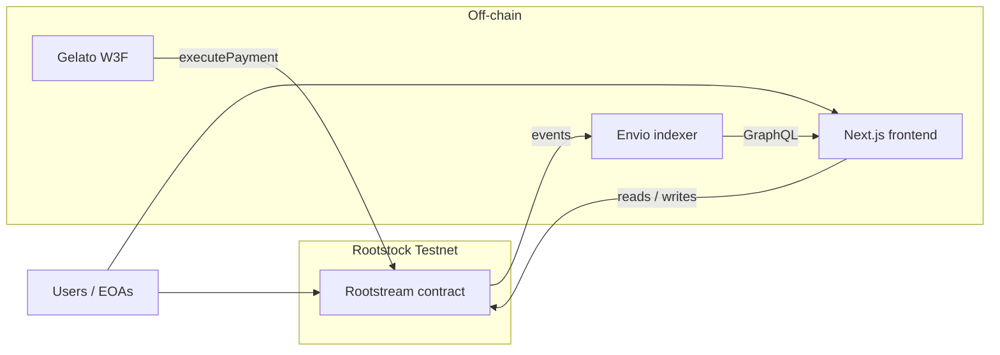

# RootStream Kit

Starter kit for **prepaid native-token recurring payment streams** on **Rootstock Testnet (EVM chain id 31)**. It includes a **Solidity** contract (**Rootstream**), a **Gelato Web3 Function** to run `executePayment` on schedule, an **Envio HyperIndex** that exposes events over **GraphQL**, and a **Next.js** dashboard (wallet, streams, funds, history).

This README is the **map of the whole repo**. Each package has its own **README** with commands, env vars, and troubleshooting in depth.

### First clone (submodules)

The Foundry standard library lives under **`contracts/lib/forge-std`**. After cloning, run this **once** from the repo root:

```bash
git submodule update --init --recursive
```

Without it, **`forge build`** in **`contracts/`** will fail with missing **`forge-std`**.

---

## What you get

| Piece | Role |
|-------|------|
| **Contracts** | `Rootstream`: deposit RBTC, create streams, permissionless `executePayment`, cancel, withdraw when idle. |
| **Gelato** | Serverless checker that batches due `executePayment` calls for Automate. |
| **Envio** | Indexes contract events into `Stream`, `Payment`, `User`, etc., for fast UI queries. |
| **Frontend** | Next.js 16 app: RainbowKit + wagmi, Apollo → Envio, viem `getLogs` where needed. |



---

## Repository layout

| Directory | Stack | README |
|-----------|--------|--------|
| **`contracts/`** | Foundry, Solidity `^0.8.20` | [contracts/README.md](contracts/README.md) |
| **`gelato/`** | TypeScript, `@gelatonetwork/web3-functions-sdk` | [gelato/README.md](gelato/README.md) |
| **`envio/`** | Envio HyperIndex, `schema.graphql`, handlers | [envio/README.md](envio/README.md) |
| **`frontend/`** | Next.js 16, Tailwind 4, wagmi, Apollo | [frontend/README.md](frontend/README.md) |

---

## Prerequisites (all packages)

Install what you need for the paths you will run:

| Tool | Used by | Notes |
|------|---------|--------|
| **Git** | Whole repo | Submodules: `contracts/lib/forge-std` (`git submodule update --init --recursive`). |
| **Foundry** (`forge`) | `contracts/` | Deploy + tests. |
| **Node.js** ≥ **20.9** | `frontend/`, `gelato/` | Required by Next.js 16. |
| **npm** | `frontend/`, `gelato/` | Default in docs; others work if you adapt commands. |
| **pnpm** | `envio/` | `package.json` scripts call `pnpm envio`; see [envio/README.md](envio/README.md) for npm alternatives. |
| **Docker** (optional) | Envio | Some Envio flows expect Docker; follow current Envio docs if prompted. |

**Chain:** **Rootstock Testnet**, **chain id `31`**. Fund the deployer and test wallets with testnet RBTC (faucet via Rootstock docs).

---

## End-to-end setup (recommended order)

After a **new deploy**, keep these **in sync everywhere**: contract **address**, **deployment block**, and **Rootstock testnet RPC** (chain id **31**) across **`envio/config.yaml`**, **`frontend/.env.local`**, and **Gelato `userArgs`**. The checked-in examples point at one sample deployment; replace them if you deploy your own contract.

### 1) Deploy the contract

```bash
cd contracts
cp .env.example .env
# Set PRIVATE_KEY (testnet only) and ROOTSTOCK_TESTNET_RPC_URL
forge build && forge test
```

Deploy (Rootstock testnet; **`--legacy`** is what this kit uses in practice):

```bash
set -a && source .env && set +a
forge script script/DeployRootstream.s.sol:DeployRootstream \
  --rpc-url rootstock-testnet \
  --broadcast \
  --legacy \
  -vvvv
```

Save:

- **Contract address**
- **Deployment block number** (from explorer or `broadcast/` JSON)

Details: [contracts/README.md](contracts/README.md).

### 2) Point Envio at the deployment

In **`envio/config.yaml`** (and optional shell env overrides), set:

- **`networks[0].contracts`** (Rootstream) **`address`**: defaults use **`${ROOTSTREAM_ADDRESS:-0x…}`** — export **`ROOTSTREAM_ADDRESS`** or edit the default in **`config.yaml`**.  
- **`networks[0].start_block`**: set to your **deployment block** (or the first block you want indexed).  
- **`ROOTSTOCK_TESTNET_RPC_URL`**: HTTPS RPC with workable **`eth_getLogs`** range limits (the **`networks[0].rpc`** block reads this env var).  

Then:

```bash
cd envio
pnpm install
pnpm codegen
pnpm dev
```

Note the **GraphQL HTTP URL** the CLI prints (often Hasura-style **`/v1/graphql`**).

Details: [envio/README.md](envio/README.md).

### 3) Configure and run the frontend

```bash
cd frontend
cp .env.example .env.local
```

Set at least:

- **`NEXT_PUBLIC_ROOTSTREAM_ADDRESS`** — same as Envio  
- **`NEXT_PUBLIC_ROOTSTREAM_DEPLOY_BLOCK`** — deployment block  
- **`NEXT_PUBLIC_ENVIO_GRAPHQL_URL`** — Envio GraphQL URL (see **gotchas** below if you use WSL + a Windows browser)  
- **`NEXT_PUBLIC_RPC_URL`** — RPC that supports **`eth_getLogs`** for history / dashboard log merge (see [frontend/README.md](frontend/README.md))

```bash
npm install
npm run dev
```

Open **http://localhost:3000**. If **WSL2** kills **`next-server`** (OOM), use **`npm run preview`** or raise WSL memory; see [frontend/README.md](frontend/README.md).

### 4) (Optional) Automate execution with Gelato

```bash
cd gelato
cp .env.example .env
# PROVIDER_URLS = Rootstock testnet RPC
npm install && npm run build
npm run test:w3f
npx w3f deploy web3-functions/rootstream-payments/index.ts
```

Create an **Automate Web3 Function** task in the Gelato app; **`userArgs`** must include your **`rootstream`** address and tuning fields from **`schema.json`**.

Details: [gelato/README.md](gelato/README.md).

---

## Environment variables (cheat sheet)

Values must stay **consistent** across services (same contract address, coherent deploy block, chain 31).

| Location | File / mechanism | Main variables |
|----------|------------------|----------------|
| **Contracts** | `contracts/.env` | `PRIVATE_KEY`, `ROOTSTOCK_TESTNET_RPC_URL` |
| **Envio** | `envio/config.yaml` + shell env | `ROOTSTREAM_ADDRESS`, `ROOTSTOCK_TESTNET_RPC_URL`, plus **`networks[0].start_block`** in YAML |
| **Gelato** | `gelato/.env` | `PROVIDER_URLS` |
| **Frontend** | `frontend/.env.local` | `NEXT_PUBLIC_ROOTSTREAM_ADDRESS`, `NEXT_PUBLIC_ENVIO_GRAPHQL_URL`, `NEXT_PUBLIC_RPC_URL`, `NEXT_PUBLIC_ROOTSTREAM_DEPLOY_BLOCK`, … |

Each folder’s **`.env.example`** (where present) is the source of truth for names and comments.

---

## Local dev gotchas (read this once)

- **WSL + Windows browser + Envio:** GraphQL runs in the **browser**. If **Next** and **Envio** run inside **WSL** but you open **`http://localhost:3000` in Edge/Chrome on Windows**, then **`http://127.0.0.1:8080`** points at **Windows**, not WSL — stats stay loading or you see timeout/abort errors. Fix: in WSL run **`hostname -I`**, take the **first IPv4**, set  
  **`NEXT_PUBLIC_ENVIO_GRAPHQL_URL=http://THAT_IP:8080/v1/graphql`** in **`frontend/.env.local`**, restart **`npm run dev`**. That IP can change after **`wsl --shutdown`**.
- **WSL out-of-memory:** If **`next-server`** dies right after **`○ Compiling /`**, check **`dmesg`** for OOM; raise **`.wslconfig`** memory or use **`npm run preview`** in **`frontend/`** (see [frontend/README.md](frontend/README.md)).
- **Envio already running:** **`EADDRINUSE … :9898`** means another **`pnpm dev`** is still using the port — stop it or kill the old process.
- **Env vars:** Restart the Next dev server after editing **`NEXT_PUBLIC_*`**.

---

## RPC and `eth_getLogs`

Public nodes sometimes **disable or narrow** **`eth_getLogs`**. That breaks:

- **Gelato** log-based stream discovery (unless you use **`preferScan`** in `userArgs`), and  
- **Frontend** payment log scans for history / dashboard.

Prefer an RPC provider that documents log support (for example **Rootstock RPC** with a key). See [gelato/README.md](gelato/README.md) and [frontend/README.md](frontend/README.md).

---

## Security and scope

- Use **testnet keys and small balances** only. Never commit **`.env`**, **`.env.local`**, or real **mainnet** keys.
- **Gelato** and **Envio** dependencies may surface **low-severity `npm audit`** noise; follow each README before running **`npm audit fix --force`**.
- **Smart contracts are not audited** as part of this kit; use for learning and testnet unless you engage a proper review.

---

## Troubleshooting (quick links)

| Symptom | Where to read |
|---------|----------------|
| **`forge` / deploy errors** | [contracts/README.md](contracts/README.md) |
| **`w3f test` / RPC / WSL DNS** | [gelato/README.md](gelato/README.md) |
| **Envio codegen / sync / GraphQL** | [envio/README.md](envio/README.md) |
| **Next dev dies (OOM), Envio URL / WSL browser, Apollo** | [frontend/README.md](frontend/README.md) |

---

## Verification checklist (for reviewers)

Run these **in order** to confirm each layer works. You need **Git**, **Foundry**, **Node 20+**, **npm**, and **pnpm** (for Envio) on your PATH.

| Step | Directory | Command | Success looks like |
|------|-----------|---------|-------------------|
| 1 | repo root | `git submodule update --init --recursive` | **`contracts/lib/forge-std`** populated |
| 2 | **`contracts/`** | `cp .env.example .env` → set **`PRIVATE_KEY`**, **`ROOTSTOCK_TESTNET_RPC_URL`** → `forge build && forge test` | Tests pass; **`out/`** artifacts |
| 3 | **`envio/`** | `pnpm install` → `pnpm codegen` | **`generated/`** created without errors |
| 4 | **`envio/`** | `pnpm dev` | CLI prints a **GraphQL HTTP** URL (often **`…/v1/graphql`**); indexer syncs |
| 5 | **`frontend/`** | `cp .env.example .env.local` → set **`NEXT_PUBLIC_*`** to match your contract + Envio URL → `npm install` → `npm run dev` | App loads at **http://localhost:3000**; wallet connects on chain **31** |
| 6 | **`frontend/`** | `npm run build` | Production build completes |
| 7 (optional) | **`gelato/`** | `cp .env.example .env` → align **`userArgs.json`** → `npm install` → `npm run build` → `npm run test:w3f` | W3F run completes (see [gelato/README.md](gelato/README.md)) |

**Partial stack:** Steps **2** + **5** alone can work if you point the frontend at an **already deployed** contract and a **reachable RPC**; **Envio** (steps 3–4) is required for **GraphQL-backed** analytics and some tables to populate. **Gelato** (step 7) is optional for UI verification.

---

## License

See **license files** or **SPDX** headers in subprojects if present; treat this kit as **starter / educational** unless you add your own licensing policy.
